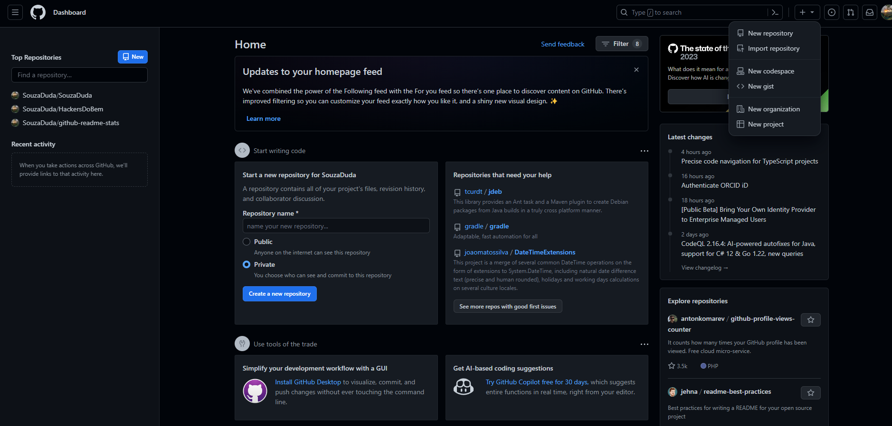

<h1>Git-Bash</h1>
 

 Aula de recursos básicos para o uso do GitHub!

 

Dupla, Março 2024

<ul>
  <li>Maria Eduarda, @SouzaDuda</li>
  <li>Vitor Vicente, @VitorS4turn01</li>

<h2> Criação de repositório</h2>

<h4> Passo a passo</h4>

 

Essa é a tela inicial do github. Para criarmos um repositório devemos clicar no símbolo de '+'

Após clicar no símbolo, várias opções serão exibidas portanto para criarmos nosso próprio repositório a opção a ser marcada é 'New Repository'

Assim que clicar na opção a tela que irá aparecer será a seguinte, totalmente vazia com algumas opções que você pode adicionar ou não.

Este é um exemplo de repositório com algumas opções selecionadas.

# Comandos do Git Bash

#### O que é o Git? 
O Git é um sistema para facilitar o controle de versões, usado para resgistrar o histórico de edições.

## Passo a Passo
<ul>
 <li>Configuração inicial, iremos configurar o usuário (usuário cadastrado no Github) e o email (utilizado também no cadastro).
 Abaixo está um exemplo, mais alguns erros de digitação mostrando que um simples erro muda tudo.</li></ul> 
É importante lembrar, que você deve ter o mínimo de organização com suas contas e informações pessoais.
 
<h3>Comandos utilizados</h3> 
<ul>
<li>git config --global user.name "usuário" - Onde o "usuário" é o seu nome de usuário do github.</li> 
<li>gif config --global user.email "email" - Onde o "email" é o seu email cadrastrado.</li> 

Não se esqueça de abrir o Git na pasta com os arquivos que devem ser enviados!

<li>git init - Iniciação</li> 
<li>git remote add origin "link" - Adiciona onde os arquivos serão direcionados.</li> 
<li>git pull --allow-unrelated-histories "link" - Mescla os arquivos do servidor com os locais.</li> 

# Criação de pasta, mais comum e outros modos

#### Modo mais comum

Bem para a criação de pasta do modo mais comum, vá a área de trabalho e com o botão direito do mouse clique em "+ Novo" e selecione Pasta.
Assim que a pasta irá aparecer, agora você pode configurar da maneira que desejar.

Assim colocamos os prints e mudamos o nome da mesma.

#### Outros modos

Outros modos é por meio do Prompt do comando do Windows ou pelo PowerShell
